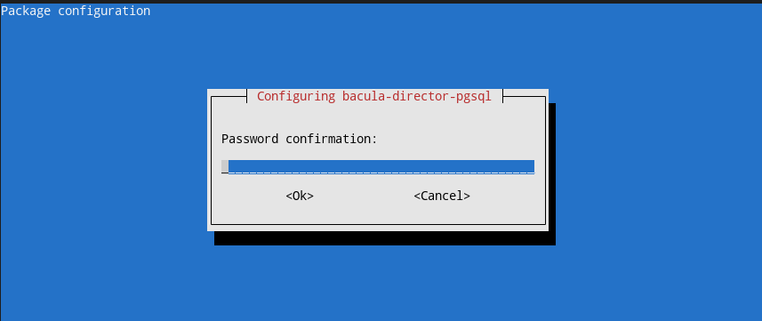

# Домашнее задание к занятию 10.4 «Резервное копирование» - `Елена Махота`


* [Ответ к Заданию 1](#1)
* [Ответ к Заданию 2](#2)
* [Ответ к Заданию 3](#3)
* [Ответ к Заданию 4*](#4)

---

### Задание 1

В чём разница между:

- полным резервным копированием,
- дифференциальным резервным копированием,
- инкрементным резервным копированием.

*Приведите ответ в свободной форме.*

### *<a name="1"> Ответ к Заданию 1 </a>*


| **Резервное копирование**    | **полное**                                                                  | **дифференциальное**                                                                   | **инкрементное**                                                                |
|------------------------------|-----------------------------------------------------------------------------|----------------------------------------------------------------------------------------|----------------------------------------------------------------------------------|
| **Объем сохраненных данных** | все данные                                                                  | данные, измененные после последнего полного бэкапа                                     | данные, измененные после последнего инкрементного бэкапа                         |
| **Отправная точка**          | текущий момент                                                              | последний полный бэкап                                                                 | последний  бэкап                                                                 |
| **Ресурсы**                  | времязатратный процесс, высокая нагрузка на систему, большой оъем хранилища | ресурсов требуется меньше чем для полного копирования, но больше чем для инкрементного | наименьшие затраты ресурсов                                                      |
| **Восстановление**           | Быстрое                                                                     | Среднее                                                                                | Медленное                                                                        |
| **Сохранность данных**       | Сохранность данных в полном объеме                                          | успешное восстановление данных зависит от целостности последнего бэкапа                | успешное восстановление данных зависит от целостности всех инкрементов в цепочке |


Использованные источники:

\- [Презентация "Отказоустойчивость: Резервное копирование. Bacula", Александр Зубарев](https://u.netology.ru/backend/uploads/lms/attachments/files/data/27925/SRLB-9__%D0%A0%D0%B5%D0%B7%D0%B5%D1%80%D0%B2%D0%BD%D0%BE%D0%B5_%D0%BA%D0%BE%D0%BF%D0%B8%D1%80%D0%BE%D0%B2%D0%B0%D0%BD%D0%B8%D0%B5._Bacula.pdf)

\- https://habr.com/ru/company/ruvds/blog/678364/

---

### Задание 2

Установите программное обеспечении Bacula, настройте bacula-dir, bacula-sd,  bacula-fd. Протестируйте работу сервисов.

*Пришлите конфигурационные файлы для bacula-dir, bacula-sd,  bacula-fd.*

### *<a name="2"> Ответ к Заданию 2 </a>*

Структура Bacula


\* https://www.bacula.org/13.0.x-manuals/en/main/Customizing_Configuration_F.html

Установка Bacula 

```bash
sudo apt install bacula postgresql 
```

В ходе установки потребуется выбрать, где будет база данных, выберем localhost. Далее установка пароля для входа, можно установить любой (главное запомнить).


Проверяем, что сервисы запущены

```bash
sudo service --status-all | grep bacula
```

stdout

```bash
 [ + ]  bacula-director
 [ + ]  bacula-fd
 [ + ]  bacula-sd
```

Смотрим документацию

```bash
cd /usr/share/doc/bacula-doc/
cat ./bacula-director/examples/conf/console.conf # примеры конфигураций
```


Cоздадим новые каталоги для хранения резервных копий

```bash
sudo mkdir -p /bacula
```
Нужно изменить права доступа к файлам, чтобы только процесс bacula (и суперпользователь) мог получить доступ к созданным каталогам:

```bash
sudo chown -R bacula:bacula /bacula 
sudo chmod -R 700 /bacula
```

**Настройка Bacula Storage (сервис bacula-sd)** — хранилище, предназначенное для сохранения резервных копий на диске. 


sudo nano /etc/bacula/[bacula-sd.conf](bacula-local/bacula-sd.conf)


```bash
Storage {                             # definition of myself
  Name = makhota-vm01-sd
  SDPort = 9103                  # Director's port
  WorkingDirectory = "/var/lib/bacula"
  Pid Directory = "/run/bacula"
  Plugin Directory = "/usr/lib/bacula"
  Maximum Concurrent Jobs = 20
  SDAddress = 127.0.0.1
}

Director {
  Name = makhota-vm01-dir
  Password = "kH3eGQmWACQ6_QXz6_wg1VEmTKpu3jtlW"
}

Director {
  Name = makhota-vm01-mon
  Password = "65UL04B6k2Vb-DZBefffReeBPXQv-4dCQ"
  Monitor = yes
}

Device {
  Name = Local-Device
  Media Type = File
  Archive Device = /bacula
  LabelMedia = yes;                   # lets Bacula label unlabeled media
  Random Access = Yes;
  AutomaticMount = yes;               # when device opened, read it
  RemovableMedia = no;
  AlwaysOpen = yes;
  Maximum Concurrent Jobs = 5
}


Messages {
  Name = Standard
  director = makhota-vm01-dir = all
}
```
После редактирования настроек выполняем проверку получившийся конфигурации:

```bash
sudo /usr/sbin/bacula-sd -t -c /etc/bacula/bacula-sd.conf
```


**Настройка Bacula File Daemon (сервис bacula-fd)** — клиентская часть сервиса, которая нужна для доступа к файлам на сервере, с которого будет выполняться резервное копирование.

sudo nano /etc/bacula/[bacula-fd.conf](bacula-local/bacula-fd.conf)

```bash
Director {
  Name = makhota-vm01-dir
  Password = "WINc4vyZbDintjLIL4sP79k75ahSA2Hvy"
}

Director {
  Name = makhota-vm01-mon
  Password = "zqXUneB37UhvtNFHaELoHNMrTxCk1CHbW"
  Monitor = yes
}

FileDaemon {                          # this is me
  Name = makhota-vm01-fd
  FDport = 9102                  # where we listen for the director
  WorkingDirectory = /var/lib/bacula
  Pid Directory = /run/bacula
  Maximum Concurrent Jobs = 20
  Plugin Directory = /usr/lib/bacula
  FDAddress = 127.0.0.1
}

Messages {
  Name = Standard
  director = makhota-vm01-dir = all, !skipped, !restored
}

```

После редактирования настроек выполняем проверку получившийся конфигурации:

```bash
sudo /usr/sbin/bacula-fd -t -c /etc/bacula/bacula-fd.conf
```

**Настройка Bacula Director (сервис bacula-dir)** — основной сервис, который управляет всеми другими процессами по резервному копированию и восстановлению.

sudo nano /etc/bacula/[bacula-dir.conf](bacula-local/bacula-dir.conf)

```bash
Director {                            # define myself
  Name = makhota-vm01-dir
  DIRport = 9101                # where we listen for UA connections
  QueryFile = "/etc/bacula/scripts/query.sql"
  WorkingDirectory = "/var/lib/bacula"
  PidDirectory = "/run/bacula"
  Maximum Concurrent Jobs = 20
  Password = "u-WxA-XfH79YuKh_fX2LhrKq6YlIGIOWD"         # Console password
  Messages = Daemon
  DirAddress = 127.0.0.1
}

JobDefs {
  Name = "DefaultJob"
  Type = Backup
  Level = Incremental
  Client = makhota-vm01-fd
  FileSet = "System"
  Schedule = "WeeklyCycle"
  Storage = makhota-vm01-sd
  Messages = Standard
  Pool = LocalPool
  SpoolAttributes = yes
  Priority = 10
  Write Bootstrap = "/var/lib/bacula/%c.bsr"
}


Job {
  Name = "System"
  JobDefs = "DefaultJob"
  Enabled = yes
  Level = Full
  FileSet="System"
  Schedule = "WeeklyCycle"
  Priority = 11
  Storage = makhota-vm01-sd
  Pool = LocalPool
}

FileSet {
  Name = "System"
  Include {
    Options {
      signature = MD5
    }

File = /etc
  }    
}

Schedule {
  Name = "WeeklyCycle"
  Run = Full 1st sun at 23:05
  Run = Differential 2nd-5th sun at 23:05
  Run = Incremental mon-sat at 23:05
}

Client {
  Name = makhota-vm01-fd
  Address = localhost
  FDPort = 9102
  Catalog = MyCatalog
  Password = "WINc4vyZbDintjLIL4sP79k75ahSA2Hvy"          # password for FileDaemon
  File Retention = 60 days            # 60 days
  Job Retention = 6 months            # six months
  AutoPrune = yes                     # Prune expired Jobs/Files
}

Autochanger {
  Name = makhota-vm01-sd
# Do not use "localhost" here
  Address = localhost                # N.B. Use a fully qualified name here
  SDPort = 9103
  Password = "kH3eGQmWACQ6_QXz6_wg1VEmTKpu3jtlW"
  Device = Local-Device
  Media Type = File
  Maximum Concurrent Jobs = 10        # run up to 10 jobs a the same time
  Autochanger = makhota-vm01-sd                 # point to ourself
}


Catalog {
  Name = MyCatalog
  dbname = "bacula"; DB Address = "localhost"; dbuser = "bacula"; dbpassword = "1"
}

Messages {
  Name = Standard
  mailcommand = "/usr/sbin/bsmtp -h localhost -f \"\(Bacula\) \<%r\>\" -s \"Bacula: %t %e of %c %l\" %r"
  operatorcommand = "/usr/sbin/bsmtp -h localhost -f \"\(Bacula\) \<%r\>\" -s \"Bacula: Intervention needed for %j\" %r"
  mail = root = all, !skipped
  operator = root = mount
  console = all, !skipped, !saved
  append = "/var/log/bacula/bacula.log" = all, !skipped
  catalog = all
}

Messages {
  Name = Daemon
  mailcommand = "/usr/sbin/bsmtp -h localhost -f \"\(Bacula\) \<%r\>\" -s \"Bacula daemon message\" %r"
  mail = root = all, !skipped
  console = all, !skipped, !saved
  append = "/var/log/bacula/bacula.log" = all, !skipped
}

Pool {
  Name = LocalPool
  Pool Type = Backup
  Recycle = yes                       # Bacula can automatically recycle Volumes
  AutoPrune = yes                     # Prune expired volumes
  Volume Retention = 365 days         # one year
  Maximum Volume Bytes = 10G          # Limit Volume size to something reasonable
  Maximum Volumes = 100               # Limit number of Volumes in Pool
  Label Format = "Local-"
}


Console {
  Name = makhota-vm01-mon
  Password = "3AFL0oYpT0HNNGROPsl9tNNZtz51Pmds8"
  CommandACL = status, .status
}


```

После редактирования настроек выполняем проверку получившийся конфигурации:

```bash
sudo /usr/sbin/bacula-dir -t -c /etc/bacula/bacula-dir.conf
```

Связи паролей и имен:


\* https://www.bacula.org/13.0.x-manuals/en/main/Customizing_Configuration_F.html 

Перезапускаем службы

```bash
sudo systemctl restart bacula-sd
sudo systemctl restart bacula-fd
sudo systemctl restart bacula-dir
```

Входим в консоль `bconsole`, можно посмотреть `help`, `status`.

Вводим `mount`,

stdout

```bash
Automatically selected Catalog: MyCatalog
Using Catalog "MyCatalog"
Automatically selected Storage: makhota-vm01-sd
Connecting to Storage daemon makhota-vm01-sd at localhost:9103 ...
3998 Device ""Local-Device" (/bacula)" is not an autochanger.
3906 File device ""Local-Device" (/bacula)" is always mounted.
You have messages.
```
Вводим `run`,

stdout

```bash
A job name must be specified.
Automatically selected Job: System
Run Backup job
JobName:  System
Level:    Full
Client:   makhota-vm01-fd
FileSet:  System
Pool:     LocalPool (From Job resource)
Storage:  makhota-vm01-sd (From Job resource)
When:     2023-01-18 23:14:49
Priority: 11
OK to run? (yes/mod/no): yes
Job queued. JobId=15
```
Выходим из консоли `exit`.

Посмотреть логи

```bash 
sudo cat /var/log/bacula/bacula.log
```

Stdout

```
18-Jan 23:14 makhota-vm01-dir JobId 15: Start Backup JobId 15, Job=System.2023-01-18_23.14.53_03
18-Jan 23:14 makhota-vm01-dir JobId 15: Created new Volume="Local-0015", Pool="LocalPool", MediaType="File" in catalog.
18-Jan 23:14 makhota-vm01-dir JobId 15: Using Device "Local-Device" to write.
18-Jan 23:14 makhota-vm01-sd JobId 15: Labeled new Volume "Local-0015" on File device "Local-Device" (/bacula).
18-Jan 23:14 makhota-vm01-sd JobId 15: Wrote label to prelabeled Volume "Local-0015" on File device "Local-Device" (/bacula)
18-Jan 23:14 makhota-vm01-sd JobId 15: Elapsed time=00:00:02, Transfer rate=1.034 M Bytes/second
18-Jan 23:14 makhota-vm01-sd JobId 15: Sending spooled attrs to the Director. Despooling 307,063 bytes ...
18-Jan 23:14 makhota-vm01-dir JobId 15: Bacula makhota-vm01-dir 9.6.7 (10Dec20):
  Build OS:               x86_64-pc-linux-gnu debian bullseye/sid
  JobId:                  15
  Job:                    System.2023-01-18_23.14.53_03
  Backup Level:           Full
  Client:                 "makhota-vm01-fd" 9.6.7 (10Dec20) x86_64-pc-linux-gnu,debian,bullseye/sid
  FileSet:                "System" 2023-01-18 21:43:52
  Pool:                   "LocalPool" (From Job resource)
  Catalog:                "MyCatalog" (From Client resource)
  Storage:                "makhota-vm01-sd" (From Job resource)
  Scheduled time:         18-Jan-2023 23:14:49
  Start time:             18-Jan-2023 23:14:55
  End time:               18-Jan-2023 23:14:57
  Elapsed time:           2 secs
  Priority:               11
  FD Files Written:       1,529
  SD Files Written:       1,529
  FD Bytes Written:       1,879,384 (1.879 MB)
  SD Bytes Written:       2,069,462 (2.069 MB)
  Rate:                   939.7 KB/s
  Software Compression:   None
  Comm Line Compression:  51.3% 2.1:1
  Snapshot/VSS:           no
  Encryption:             no
  Accurate:               no
  Volume name(s):         Local-0015
  Volume Session Id:      1
  Volume Session Time:    1674072831
  Last Volume Bytes:      2,103,938 (2.103 MB)
  Non-fatal FD errors:    0
  SD Errors:              0
  FD termination status:  OK
  SD termination status:  OK
  Termination:            Backup OK

18-Jan 23:14 makhota-vm01-dir JobId 15: Begin pruning Jobs older than 6 months .
18-Jan 23:14 makhota-vm01-dir JobId 15: No Jobs found to prune.
18-Jan 23:14 makhota-vm01-dir JobId 15: Begin pruning Files.
18-Jan 23:14 makhota-vm01-dir JobId 15: No Files found to prune.
18-Jan 23:14 makhota-vm01-dir JobId 15: End auto prune.

```

Использованные источники:

\- [Презентация "Отказоустойчивость: Резервное копирование. Bacula", Александр Зубарев](https://u.netology.ru/backend/uploads/lms/attachments/files/data/27925/SRLB-9__%D0%A0%D0%B5%D0%B7%D0%B5%D1%80%D0%B2%D0%BD%D0%BE%D0%B5_%D0%BA%D0%BE%D0%BF%D0%B8%D1%80%D0%BE%D0%B2%D0%B0%D0%BD%D0%B8%D0%B5._Bacula.pdf)

\- [tyler-hitzeman/bacula/troubleshooting.md](https://github.com/tyler-hitzeman/bacula/blob/master/troubleshooting.md?ysclid=ld21rgczxw425033857)

---

### Задание 3

Установите программное обеспечении Rsync. Настройте синхронизацию на двух нодах. Протестируйте работу сервиса.

*Пришлите рабочую конфигурацию сервера и клиента Rsync.*

### *<a name="3"> Ответ к Заданию 3 </a>*

C помощью terraform создано 3 машины:

[rsync/main.tf](rsync/main.tf)

### `makhota-vm10 10.128.0.10` - первый рабочий сервер, который нужно архивировать

Конфигурация для `makhota-vm10 10.128.0.10`

[/etc/rsyncd.conf](rsync/rsyncd.conf)

```bash
pid file = /var/run/rsyncd.pid
log file = /var/log/rsyncd.log
transfer logging = true
munge symlinks = yes
# папка источник для бэкапа
[data]
path = /etc/default
uid = root
read only = yes
list = yes
comment = Data backup Dir
auth users = backup
secrets file = /etc/rsyncd.scrt
```

[/etc/rsyncd.scrt](rsync/rsyncd.scrt)


```bash
backup:12345
```

При создании машины исполнен установочный скрипт

[rsync/setuprsync.sh](rsync/setuprsync.sh)

```bash
#!/bin/bash

# Устанавливаем rsync

sudo apt install rsync

# Настройка конфигурации по умолчанию, меняем значение RSYNC_ENABLE = true

sudo sed -i 's/RSYNC_ENABLE=false/RSYNC_ENABLE=true/g' /etc/default/rsync

# Копируем нужный файл кофигурации  /etc/rsyncd.conf

sudo cp /home/user/rsync/rsyncd.conf /etc/rsyncd.conf

# Копируем нужный файл c паролем пользователя backup  /etc/rsyncd.scr

sudo cp /home/user/rsync/rsyncd.scrt /etc/rsyncd.scrt

# Выдаем права

sudo chmod 0600 /etc/rsyncd.conf
sudo chmod 0600 /etc/rsyncd.scrt

# Запускаем службу, проверяем статус

sudo systemctl start rsync 
sudo service --status-all | grep rsync
sudo netstat -tulnp | grep rsync

#Вносим данные в скрипт для архивации на другой сервер

sed -i "s/.*srv_ip=.*/srv_ip=$(hostname -I)/" /home/user/rsync/backup-vm1.sh
sed -i "s/.*srv_name=.*/srv_name=$(hostname)/" /home/user/rsync/backup-vm1.sh
cp /home/user/rsync/backup-vm1.sh /home/user/rsync/backup-$(hostname).sh
sudo apt install sshpass
sudo ssh-keyscan -t rsa 10.128.0.103 >> ~/.ssh/known_hosts
sshpass -p1 scp /home/user/rsync/backup-$(hostname).sh user@10.128.0.103:/home/user/
sshpass -p1 scp /home/user/rsync/backup-$(hostname).sh user@10.128.0.103:/home/user/

# Добавление ежедневного резервного копирования в 00:20 в шедулер удаленного сервера для резервного копирования

echo "20 00 * * * root /root/scripts/backup-$(hostname).sh 2>&1 >> /home/user/rsync/logrsync-$(hostname).txt" | sshpass -p1 ssh  user@10.128.0.103 -T "sudo tee -a /etc/crontab"


```

### `makhota-vm11 10.128.0.11` - второй рабочий сервер, который нужно архивировать

Конфигурация и установка - идентичны первому рабочему серверу.

### `makhota-server 10.128.0.103 ` - сервер для хранения архивов


Конфигурация для `makhota-server 10.128.0.103`

[/etc/rsyncd.conf](rsync/rsyncd.conf)

```bash
pid file = /var/run/rsyncd.pid
log file = /var/log/rsyncd.log
transfer logging = true
munge symlinks = yes
# папка источник для бэкапа
[data]
path = /etc/default
uid = root
read only = yes
list = yes
comment = Data backup Dir
auth users = backup
secrets file = /etc/rsyncd.scrt
```

[/etc/rsyncd.scrt](rsync/rsyncdmain.scrt)

*Без указания пользователя*

```bash
12345
```

При создании машины исполнен установочный скрипт

[rsync/setuprsyncmain.sh](rsync/setuprsyncmain.sh)

```bash
#!/bin/bash

# Устанавливаем rsync

sudo apt install rsync

#Устанавливаем пароль для user

yes 1 |sudo passwd user

# Настройка конфигурации по умолчанию, меняем значение RSYNC_ENABLE = true

sudo sed -i 's/RSYNC_ENABLE=false/RSYNC_ENABLE=true/g' /etc/default/rsync

# Копируем нужный файл кофигурации  /etc/rsyncd.conf

sudo cp /home/user/rsync/rsyncd.conf /etc/rsyncd.conf

# Копируем нужный файл c паролем пользователя backup  /etc/rsyncd.scr

sudo cp /home/user/rsync/rsyncdmain.scrt /etc/rsyncd.scrt

# Выдаем права
sudo chmod 0600 /etc/rsyncd.conf
sudo chmod 0600 /etc/rsyncd.scrt

# Запускаем службу, проверяем статус

sudo systemctl start rsync 
sudo service --status-all | grep rsync
sudo netstat -tulnp | grep rsync

# Устанавливаем sshpass
sudo apt update
sudo apt install sshpass

# Перекладываем скрипты в специальный каталог. 
#Настраиваем скрипт для выполнения синхронизации: 
sudo mkdir /root/scripts/
sudo cp /home/user/*.sh /root/scripts/
sudo chmod -R 0744 /root/scripts/

#Перезапускаем шедулер с учетом дозаписи в него строк для архивирования удаленных хостов
sudo systemctl restart cron
#Перезапускаем хост для обновления системного времени
sudo shutdown -r +2

```

Скрипты для инкрементного архивирования, которые создаются на сервере для хранения архивов `makhota-server 10.128.0.103` и архивируют соответствующие папки `/etc/default` с `makhota-vm10 10.128.0.10` и `makhota-vm11 10.128.0.11`

[/root/scripts/backup-makhota-vm10.sh](rsync/backup-makhota-vm10.sh)

```bash
#!/bin/bash
echo "***"

date
# Папка, куда будем складывать архивы — ее либо сразу создать либо не создавать а положить в уже существующие
syst_dir=/backup/
# Имя сервера, который архивируем
srv_name=makhota-vm10
# Адрес сервера, который архивируем
srv_ip=10.128.0.10 
# Пользователь rsync на сервере, который архивируем
srv_user=backup
# Ресурс на сервере для бэкапа
srv_dir=data


#Вывод в консоль информации о запуске бекапа

echo "Start backup ${srv_name}"
# Создаем папку для инкрементных бэкапов
mkdir -p ${syst_dir}${srv_name}/increment/
# Запускаем копирование

#-a, --archive Эквивалентно набору -rlptgoD. Это быстрый способ указать, что Вам нужна рекурсия 
# и Вы хотите сохранить почти все. -a не сохраняет жесткие ссылки, для этого отдельно указывать -H.

#-v, --verbose увеличить уровень подробностей

#-z, --compress С этим параметром rsync сжимает все передаваемые данные файлов.

#--delete Удалять любые файлы на приемной стороне, которых нет на передающей

#--password-file Позволяет Вам предоставить пароль для доступа к rsync-серверу, сохранив его в файле.

#-b, --backup создавать резервную копию (см. --suffix и --backup-dir)
# --backup-dir создавать резервную копию в этом каталоге

/usr/bin/rsync -avz --progress --delete --password-file=/etc/rsyncd.scrt \
${srv_user}@${srv_ip}::${srv_dir} ${syst_dir}${srv_name}/current/ --backup \
--backup-dir=${syst_dir}${srv_name}/increment/`date +%Y-%m-%d`/

#Найти и удалить файлы старше 30 дней

# -type — тип искомого: f=файл, d=каталог, l=ссылка (link).
# -mtime — время последнего изменения файла.
# -exec command {} \; — выполняет над найденным файлом указанную команду; обратите внимание на синтаксис.

# -maxdepth 1 ограничить глубину поиска значением «1». 
#Так вы ограничитесь поиском в текущей папке, не залезая в подпапки.


/usr/bin/find ${syst_dir}${srv_name}/increment/ -maxdepth 1 -type d -mtime +30 -exec rm -rf {} \;

#Вывести дату в консоль

date

#Вывести в консоль информацию о завершении бекапа на конкретной машине
echo "Finish backup ${srv_name} ip ${srv_ip}"
echo "***"


```

Для второй машины то же самое, отличаются только 

```bash
# Имя сервера, который архивируем
srv_name=makhota-vm11
# Адрес сервера, который архивируем
srv_ip=10.128.0.11 
```

[/root/scripts/backup-makhota-vm11.sh](rsync/backup-makhota-vm11.sh)


### Проверяем работу скриптов по архивированию с помощью rsinc, запушенных шедулером:

**Stdout**

```bash
user@makhota-server:~$ date
Wed 25 Jan 2023 12:19:20 AM MSK
user@makhota-server:~$ ls
backup-makhota-vm10.sh  backup-makhota-vm11.sh  rsync
user@makhota-server:~$ ls /
bin   dev  home        initrd.img.old  lib32  libx32      media  opt   root  sbin  sys  usr  vmlinuz
boot  etc  initrd.img  lib             lib64  lost+found  mnt    proc  run   srv   tmp  var  vmlinuz.old
user@makhota-server:~$ date
Wed 25 Jan 2023 12:20:15 AM MSK
user@makhota-server:~$ ls /
backup  dev   initrd.img      lib32   lost+found  opt   run   sys  var
bin     etc   initrd.img.old  lib64   media       proc  sbin  tmp  vmlinuz
boot    home  lib             libx32  mnt         root  srv   usr  vmlinuz.old
user@makhota-server:~$ cat /etc/crontab 
# /etc/crontab: system-wide crontab
# Unlike any other crontab you don't have to run the `crontab'
# command to install the new version when you edit this file
# and files in /etc/cron.d. These files also have username fields,
# that none of the other crontabs do.

SHELL=/bin/sh
PATH=/usr/local/sbin:/usr/local/bin:/sbin:/bin:/usr/sbin:/usr/bin

# Example of job definition:
# .---------------- minute (0 - 59)
# |  .------------- hour (0 - 23)
# |  |  .---------- day of month (1 - 31)
# |  |  |  .------- month (1 - 12) OR jan,feb,mar,apr ...
# |  |  |  |  .---- day of week (0 - 6) (Sunday=0 or 7) OR sun,mon,tue,wed,thu,fri,sat
# |  |  |  |  |
# *  *  *  *  * user-name command to be executed
17 *    * * *   root    cd / && run-parts --report /etc/cron.hourly
25 6    * * *   root    test -x /usr/sbin/anacron || ( cd / && run-parts --report /etc/cron.daily )
47 6    * * 7   root    test -x /usr/sbin/anacron || ( cd / && run-parts --report /etc/cron.weekly )
52 6    1 * *   root    test -x /usr/sbin/anacron || ( cd / && run-parts --report /etc/cron.monthly )
#
20 00 * * * root /root/scripts/backup-makhota-vm11.sh 2>&1 >> /home/user/rsync/logrsync-makhota-vm11.txt
20 00 * * * root /root/scripts/backup-makhota-vm10.sh 2>&1 >> /home/user/rsync/logrsync-makhota-vm10.txt
user@makhota-server:~$ sudo cat /var/log/syslog | grep backup
Jan 25 00:20:01 makhota-server CRON[581]: (root) CMD (/root/scripts/backup-makhota-vm11.sh 2>&1 >> /home/user/rsync/logrsync-makhota-vm11.txt)
Jan 25 00:20:01 makhota-server CRON[582]: (root) CMD (/root/scripts/backup-makhota-vm10.sh 2>&1 >> /home/user/rsync/logrsync-makhota-vm10.txt)
user@makhota-server:~$ cat /home/user/rsync/logrsync-makhota-vm10.txt 
***
Wed 25 Jan 2023 12:20:01 AM MSK
Start backup makhota-vm10
receiving incremental file list
created directory /backup/makhota-vm10/current
./
acpid
            346 100%  337.89kB/s    0:00:00 (xfr#1, to-chk=16/18)
console-setup
            285 100%  278.32kB/s    0:00:00 (xfr#2, to-chk=15/18)
cron
            955 100%  932.62kB/s    0:00:00 (xfr#3, to-chk=14/18)
dbus
            297 100%  290.04kB/s    0:00:00 (xfr#4, to-chk=13/18)
grub
          1,225 100%    1.17MB/s    0:00:00 (xfr#5, to-chk=12/18)
grub.ucf-dist
          1,225 100%    1.17MB/s    0:00:00 (xfr#6, to-chk=11/18)
hwclock
             81 100%   79.10kB/s    0:00:00 (xfr#7, to-chk=10/18)
keyboard
            150 100%  146.48kB/s    0:00:00 (xfr#8, to-chk=9/18)
locale
             54 100%   52.73kB/s    0:00:00 (xfr#9, to-chk=8/18)
networking
          1,032 100% 1007.81kB/s    0:00:00 (xfr#10, to-chk=7/18)
nss
          1,756 100%    1.67MB/s    0:00:00 (xfr#11, to-chk=6/18)
ntp
             15 100%   14.65kB/s    0:00:00 (xfr#12, to-chk=5/18)
rsync
          2,061 100%    1.97MB/s    0:00:00 (xfr#13, to-chk=4/18)
ssh
            133 100%  129.88kB/s    0:00:00 (xfr#14, to-chk=3/18)
useradd
          1,118 100%    1.07MB/s    0:00:00 (xfr#15, to-chk=2/18)
grub.d/
grub.d/init-select.cfg
            274 100%  267.58kB/s    0:00:00 (xfr#16, to-chk=0/18)

sent 343 bytes  received 6,223 bytes  13,132.00 bytes/sec
total size is 11,007  speedup is 1.68
Wed 25 Jan 2023 12:20:01 AM MSK
Finish backup makhota-vm10 ip 10.128.0.10
***
user@makhota-server:~$ ls -la /backup/
total 16
drwxr-xr-x  4 root root 4096 Jan 25 00:20 .
drwxr-xr-x 19 root root 4096 Jan 25 00:20 ..
drwxr-xr-x  4 root root 4096 Jan 25 00:20 makhota-vm10
drwxr-xr-x  4 root root 4096 Jan 25 00:20 makhota-vm11
user@makhota-server:~$ ls /backup/makhota-vm10/
current  increment
user@makhota-server:~$ ls /backup/makhota-vm10/current/
acpid          cron  grub    grub.ucf-dist  keyboard  networking  ntp    ssh    useradd
console-setup  dbus  grub.d  hwclock        locale    nss         rsync  test1
user@makhota-server:~$ ls /backup/makhota-vm10/increment/
user@makhota-server:~$

```

```bash
user@makhota-vm10:~$ sudo nano /etc/default/test1
```

```bash
user@makhota-server:~$ sudo /root/scripts/backup-makhota-vm10.sh 
***
Wed 25 Jan 2023 12:25:13 AM MSK
Start backup makhota-vm10
receiving incremental file list
./
test1
              7 100%    6.84kB/s    0:00:00 (xfr#1, to-chk=3/19)

sent 53 bytes  received 446 bytes  998.00 bytes/sec
total size is 11,014  speedup is 22.07
Wed 25 Jan 2023 12:25:13 AM MSK
Finish backup makhota-vm10 ip 10.128.0.10
***
user@makhota-server:~$ ls /backup/makhota-vm10/increment/
2023-01-25
user@makhota-server:~$ ls /backup/makhota-vm10/increment/2023-01-25/
test1
user@makhota-server:~$ cat /backup/makhota-vm10/increment/2023-01-25/test1 
123

```

Использованные источники:

\- [Презентация "Отказоустойчивость: Резервное копирование. Bacula", Александр Зубарев](https://u.netology.ru/backend/uploads/lms/attachments/files/data/27925/SRLB-9__%D0%A0%D0%B5%D0%B7%D0%B5%D1%80%D0%B2%D0%BD%D0%BE%D0%B5_%D0%BA%D0%BE%D0%BF%D0%B8%D1%80%D0%BE%D0%B2%D0%B0%D0%BD%D0%B8%D0%B5._Bacula.pdf)

\- http://www.opennet.ru/man.shtml?category=1&russian=0&topic=rsync


---

### Задание со звёздочкой*
Это задание дополнительное. Его можно не выполнять. На зачёт это не повлияет. Вы можете его выполнить, если хотите глубже разобраться в материале.

---

### Задание 4*

Настройте резервное копирование двумя или более методами, используя одну из рассмотренных команд для папки /etc/default. Проверьте резервное копирование.

*Пришлите рабочую конфигурацию выбранного сервиса по поставленной задаче.*

### *<a name="4"> Ответ к Заданию 4* </a>*


**Первый метод** - инкрементный с помощью rsync - см * [Ответ к Заданию 3](#3)

Конфигурация: [rsync/rsyncd.conf](rsync/rsyncd.conf)


**Второй метод** - полное резервное копирование с помощью bacula

Конфигурация: [bacula-remote/](bacula-remote/)


Создаем 2 рабочие машины с предустановленным bacula-fd `makhota-vm10` и `makhota-vm11` на них и сервер для архивирования `makhota-server`.

bacula-fd `makhota-vm10` и `makhota-vm11` предустановлен c использованием шаблона конфигурации [bacula-remote/bacula-fd.conf](bacula-remote/bacula-fd.conf) скриптом:

[bacula-remote/setupclient.sh](bacula-remote/setupclient.sh)

```bash
#!/bin/bash

# Устанавливаем bacula-client
sudo apt update -y
sudo apt install bacula-client -y


#Вносим данные в bacula-fd.conf

sed -i "s/Name = makhota-server-fd/Name = $(hostname)-fd/" /home/user/bacula-remote/bacula-fd.conf
sed -i "s/FDAddress = 10.128.0.103/FDAddress = $(hostname -I)/" /home/user/bacula-remote/bacula-fd.conf


# Копируем нужный файл кофигурации  /etc/bacula/bacula-fd.conf

sudo cp /home/user/bacula-remote/bacula-fd.conf /etc/bacula/bacula-fd.conf


# Выдаем права

sudo chmod 0600 /etc/bacula/bacula-fd.conf

#Cоздадим  каталог для хранения резервных копий

sudo mkdir -p /tmp/bacula-restores/$(hostname)

#Нужно изменить права доступа к файлам, чтобы только процесс bacula (и суперпользователь) мог получить доступ к созданным каталогам:

sudo chown -R bacula:bacula /tmp/bacula-restores/$(hostname)
sudo chmod -R 700 /tmp/bacula-restores/$(hostname)

# Запускаем службу, проверяем статус

sudo systemctl start bacula-fd 
# sudo service bacula-fd status -d
sudo netstat -tulnp | grep bacula

# После редактирования настроек выполняем проверку получившийся конфигурации:

sudo /usr/sbin/bacula-fd -t -c /etc/bacula/bacula-fd.conf

# Добавляем права для bacula

sudo chown -R bacula:bacula /etc/bacula/bacula-fd.conf 
sudo chmod -R 700 /etc/bacula/bacula-fd.conf
sudo systemctl restart bacula-fd

# Добавляем jobы по резервированию и копированию с клиента на удаленный сервер для архивации
sed -i "s/clientname/$(hostname)/g" /home/user/bacula-remote/jobs.conf
sed -i "s/Address = ip/Address = $(hostname -I)/" /home/user/bacula-remote/jobs.conf


sudo apt install sshpass -y
sudo ssh-keyscan -t rsa 10.128.0.103 >> ~/.ssh/known_hosts

# Добавляем информацию о сервере в /etc/hosts
sudo sed -i '$a10.128.0.103 makhota-server' /etc/hosts


cat /home/user/bacula-remote/jobs.conf  | sshpass -p1 ssh  user@10.128.0.103 -T "sudo tee -a /home/user/bacula-remote/bacula-dir.conf"
# cat /home/user/bacula-remote/jobs.conf  | sshpass -p1 ssh  user@10.128.0.103 -T "sudo tee -a /etc/bacula/bacula-dir.conf"


```

Устанавливаем bacula на `makhota-server` с помощью скрипта [bacula-remote/setupserver.sh](bacula-remote/setupserver.sh), скрипт запускаем не в процессе создания `terraform`, а на уже созданной машине, так как требуются подтверждения и пароль для базы данных в процесее установки:

```bash
#!/bin/bash
sudo apt update -y
sudo apt install bacula postgresql -y 

# Проверяем статус служб

sudo service --status-all | grep bacula

#Cоздадим новые каталоги для хранения резервных копий

sudo mkdir -p /bacula

#Нужно изменить права доступа к файлам, чтобы только процесс bacula (и суперпользователь) мог получить доступ к созданным каталогам:

sudo chown -R bacula:bacula /bacula 
sudo chmod -R 700 /bacula

# Копируем нужный файл кофигурации  /etc/bacula/bacula-sd.conf

sudo cp /home/user/bacula-remote/bacula-sd.conf /etc/bacula/bacula-sd.conf

# Копируем нужный файл кофигурации  /etc/bacula/bacula-dir.conf

sudo cp /home/user/bacula-remote/bacula-dir.conf /etc/bacula/bacula-dir.conf

# Копируем нужный файл кофигурации  /etc/bacula/bconsole.conf

sudo cp /home/user/bacula-remote/bconsole.conf /etc/bacula/bconsole.conf

# Выдаем права
sudo chown -R bacula:bacula /etc/bacula/bacula-sd.conf 
sudo chmod 0660 /etc/bacula/bacula-sd.conf
sudo chown -R bacula:bacula /etc/bacula/bacula-dir.conf 
sudo chmod 0660 /etc/bacula/bacula-dir.conf
sudo chown -R bacula:bacula /etc/bacula/bconsole.conf 
sudo chmod 0660 /etc/bacula/bconsole.conf

# После редактирования настроек выполняем проверку получившийся конфигурации:

sudo /usr/sbin/bacula-sd -t -c /etc/bacula/bacula-sd.conf
sudo /usr/sbin/bacula-dir -t -c /etc/bacula/bacula-dir.conf


# Перезапускаем службы

sudo systemctl restart bacula-sd
sudo systemctl restart bacula-fd
sudo systemctl restart bacula-dir

# Проверяем статус служб

sudo service --status-all | grep bacula

```




После установки тестируем архивирование и восстановление через `bconsole`, в том числе используем команды `status`, `run`, `restore`

Stdout

Проверяем дирректорию хранения `/bacula`  на `makhota-server` и дирректории восстановления `/tmp/bacula-restores/` на `makhota-vm10` и `makhota-vm11`

```bash

 [ + ]  bacula-director
 [ + ]  bacula-fd
 [ + ]  bacula-sd
user@makhota-server:~$ sudo bconsole
Connecting to Director localhost:9101
1000 OK: 103 makhota-server-dir Version: 9.6.7 (10 December 2020)
Enter a period to cancel a command.
*status
Status available for:
     1: Director
     2: Storage
     3: Client
     4: Scheduled
     5: Network
     6: All
Select daemon type for status (1-6): 6
makhota-server-dir Version: 9.6.7 (10 December 2020) x86_64-pc-linux-gnu debian bullseye/sid
Daemon started 01-Feb-23 22:14, conf reloaded 01-Feb-2023 22:14:28
 Jobs: run=0, running=0 mode=0,0
 Heap: heap=270,336 smbytes=60,148 max_bytes=60,148 bufs=301 max_bufs=306
 Res: njobs=6 nclients=2 nstores=1 npools=2 ncats=1 nfsets=1 nscheds=1

Scheduled Jobs:
Level          Type     Pri  Scheduled          Job Name           Volume
===================================================================================
Incremental    Backup    10  01-Feb-23 23:05    BackupIncrementalmakhota-vm10 *unknown*
Incremental    Backup    10  01-Feb-23 23:05    BackupFull-makhota-vm10 *unknown*
Incremental    Backup    10  01-Feb-23 23:05    BackupIncrementalmakhota-vm11 *unknown*
Incremental    Backup    10  01-Feb-23 23:05    BackupFull-makhota-vm11 *unknown*
====

Running Jobs:
Console connected at 01-Feb-23 22:14
No Jobs running.
====
No Terminated Jobs.
====
Connecting to Storage daemon makhota-server-sd at 10.128.0.103:9103

makhota-server-sd Version: 9.6.7 (10 December 2020) x86_64-pc-linux-gnu debian bullseye/sid
Daemon started 01-Feb-23 22:14. Jobs: run=0, running=0.
 Heap: heap=106,496 smbytes=29,963 max_bytes=150,756 bufs=125 max_bufs=126
 Sizes: boffset_t=8 size_t=8 int32_t=4 int64_t=8 mode=0,0 newbsr=0
 Res: ndevices=1 nautochgr=0

Running Jobs:
No Jobs running.
====

Jobs waiting to reserve a drive:
====

Terminated Jobs:
====

Device status:

Device File: "Local-Device" (/bacula) is not open.
   Available Space=14.56 GB
==
====

Used Volume status:
====

====

Connecting to Client makhota-vm10-fd at 10.128.0.10:9102

makhota-vm10-fd Version: 9.6.7 (10 December 2020)  x86_64-pc-linux-gnu debian bullseye/sid
Daemon started 01-Feb-23 22:09. Jobs: run=0 running=0.
 Heap: heap=106,496 smbytes=24,471 max_bytes=24,488 bufs=88 max_bufs=88
 Sizes: boffset_t=8 size_t=8 debug=0 trace=0 mode=0,0 bwlimit=0kB/s
 Plugin: bpipe-fd.so 

Running Jobs:
Director connected at: 01-Feb-23 22:14
No Jobs running.
====

Terminated Jobs:
====
Connecting to Client makhota-vm11-fd at 10.128.0.11:9102

makhota-vm11-fd Version: 9.6.7 (10 December 2020)  x86_64-pc-linux-gnu debian bullseye/sid
Daemon started 01-Feb-23 22:10. Jobs: run=0 running=0.
 Heap: heap=106,496 smbytes=24,471 max_bytes=24,488 bufs=88 max_bufs=88
 Sizes: boffset_t=8 size_t=8 debug=0 trace=0 mode=0,0 bwlimit=0kB/s
 Plugin: bpipe-fd.so 

Running Jobs:
Director connected at: 01-Feb-23 22:14
No Jobs running.
====

Terminated Jobs:
====
*run
Automatically selected Catalog: MyCatalog
Using Catalog "MyCatalog"
A job name must be specified.
The defined Job resources are:
     1: BackupIncrementalmakhota-vm10
     2: BackupFull-makhota-vm10
     3: Restore-makhota-vm10
     4: BackupIncrementalmakhota-vm11
     5: BackupFull-makhota-vm11
     6: Restore-makhota-vm11
Select Job resource (1-6): 2
Run Backup job
JobName:  BackupFull-makhota-vm10
Level:    Full
Client:   makhota-vm10-fd
FileSet:  System
Pool:     makhota-vm10-pool (From Job resource)
Storage:  makhota-server-sd (From Job resource)
When:     2023-02-01 22:14:57
Priority: 10
OK to run? (yes/mod/no): yes
Job queued. JobId=1
*run
A job name must be specified.
The defined Job resources are:
     1: BackupIncrementalmakhota-vm10
     2: BackupFull-makhota-vm10
     3: Restore-makhota-vm10
     4: BackupIncrementalmakhota-vm11
     5: BackupFull-makhota-vm11
     6: Restore-makhota-vm11
Select Job resource (1-6): 5
Run Backup job
JobName:  BackupFull-makhota-vm11
Level:    Full
Client:   makhota-vm11-fd
FileSet:  System
Pool:     makhota-vm11-pool (From Job resource)
Storage:  makhota-server-sd (From Job resource)
When:     2023-02-01 22:15:11
Priority: 10
OK to run? (yes/mod/no): yes
Job queued. JobId=2
You have messages.
*status
Status available for:
     1: Director
     2: Storage
     3: Client
     4: Scheduled
     5: Network
     6: All
Select daemon type for status (1-6): 3
The defined Client resources are:
     1: makhota-vm10-fd
     2: makhota-vm11-fd
Select Client (File daemon) resource (1-2): 1
Connecting to Client makhota-vm10-fd at 10.128.0.10:9102

makhota-vm10-fd Version: 9.6.7 (10 December 2020)  x86_64-pc-linux-gnu debian bullseye/sid
Daemon started 01-Feb-23 22:09. Jobs: run=1 running=0.
 Heap: heap=106,496 smbytes=122,390 max_bytes=328,817 bufs=103 max_bufs=129
 Sizes: boffset_t=8 size_t=8 debug=0 trace=0 mode=0,0 bwlimit=0kB/s
 Plugin: bpipe-fd.so 

Running Jobs:
Director connected at: 01-Feb-23 22:15
No Jobs running.
====

Terminated Jobs:
 JobId  Level    Files      Bytes   Status   Finished        Name 
===================================================================
     1  Full         19    11.22 K  OK       01-Feb-23 22:15 BackupFull-makhota-vm10
====
*status
Status available for:
     1: Director
     2: Storage
     3: Client
     4: Scheduled
     5: Network
     6: All
Select daemon type for status (1-6): 3
The defined Client resources are:
     1: makhota-vm10-fd
     2: makhota-vm11-fd
Select Client (File daemon) resource (1-2): 2
Connecting to Client makhota-vm11-fd at 10.128.0.11:9102

makhota-vm11-fd Version: 9.6.7 (10 December 2020)  x86_64-pc-linux-gnu debian bullseye/sid
Daemon started 01-Feb-23 22:10. Jobs: run=1 running=0.
 Heap: heap=106,496 smbytes=122,390 max_bytes=328,817 bufs=103 max_bufs=129
 Sizes: boffset_t=8 size_t=8 debug=0 trace=0 mode=0,0 bwlimit=0kB/s
 Plugin: bpipe-fd.so 

Running Jobs:
Director connected at: 01-Feb-23 22:15
No Jobs running.
====

Terminated Jobs:
 JobId  Level    Files      Bytes   Status   Finished        Name 
===================================================================
     2  Full         19    11.22 K  OK       01-Feb-23 22:15 BackupFull-makhota-vm11
====
*restore all

First you select one or more JobIds that contain files
to be restored. You will be presented several methods
of specifying the JobIds. Then you will be allowed to
select which files from those JobIds are to be restored.

To select the JobIds, you have the following choices:
     1: List last 20 Jobs run
     2: List Jobs where a given File is saved
     3: Enter list of comma separated JobIds to select
     4: Enter SQL list command
     5: Select the most recent backup for a client
     6: Select backup for a client before a specified time
     7: Enter a list of files to restore
     8: Enter a list of files to restore before a specified time
     9: Find the JobIds of the most recent backup for a client
    10: Find the JobIds for a backup for a client before a specified time
    11: Enter a list of directories to restore for found JobIds
    12: Select full restore to a specified Job date
    13: Cancel
Select item:  (1-13): 3
Enter JobId(s), comma separated, to restore: 1
You have selected the following JobId: 1

Building directory tree for JobId(s) 1 ...  
17 files inserted into the tree and marked for extraction.

You are now entering file selection mode where you add (mark) and
remove (unmark) files to be restored. No files are initially added, unless
you used the "all" keyword on the command line.
Enter "done" to leave this mode.

cwd is: /
$ done
Bootstrap records written to /var/lib/bacula/makhota-server-dir.restore.1.bsr

The Job will require the following (*=>InChanger):
   Volume(s)                 Storage(s)                SD Device(s)
===========================================================================
   
    makhota-vm10-0001         makhota-server-sd         Local-Device             

Volumes marked with "*" are in the Autochanger.


19 files selected to be restored.

The defined Restore Job resources are:
     1: Restore-makhota-vm10
     2: Restore-makhota-vm11
Select Restore Job (1-2): 1
Defined Clients:
     1: makhota-server-fd
     2: makhota-vm10-fd
     3: makhota-vm11-fd
Select the Client (1-3): 2
Run Restore job
JobName:         Restore-makhota-vm10
Bootstrap:       /var/lib/bacula/makhota-server-dir.restore.1.bsr
Where:           /tmp/bacula-restores/makhota-vm10
Replace:         Always
FileSet:         System
Backup Client:   makhota-vm10-fd
Restore Client:  makhota-vm10-fd
Storage:         makhota-server-sd
When:            2023-02-01 22:16:47
Catalog:         MyCatalog
Priority:        10
Plugin Options:  *None*
OK to run? (yes/mod/no): yes
Job queued. JobId=3
*restore all

First you select one or more JobIds that contain files
to be restored. You will be presented several methods
of specifying the JobIds. Then you will be allowed to
select which files from those JobIds are to be restored.

To select the JobIds, you have the following choices:
     1: List last 20 Jobs run
     2: List Jobs where a given File is saved
     3: Enter list of comma separated JobIds to select
     4: Enter SQL list command
     5: Select the most recent backup for a client
     6: Select backup for a client before a specified time
     7: Enter a list of files to restore
     8: Enter a list of files to restore before a specified time
     9: Find the JobIds of the most recent backup for a client
    10: Find the JobIds for a backup for a client before a specified time
    11: Enter a list of directories to restore for found JobIds
    12: Select full restore to a specified Job date
    13: Cancel
Select item:  (1-13): 3
Enter JobId(s), comma separated, to restore: 2
You have selected the following JobId: 2

Building directory tree for JobId(s) 2 ...  
17 files inserted into the tree and marked for extraction.

You are now entering file selection mode where you add (mark) and
remove (unmark) files to be restored. No files are initially added, unless
you used the "all" keyword on the command line.
Enter "done" to leave this mode.

cwd is: /
$ done
Bootstrap records written to /var/lib/bacula/makhota-server-dir.restore.2.bsr

The Job will require the following (*=>InChanger):
   Volume(s)                 Storage(s)                SD Device(s)
===========================================================================
   
    makhota-vm11-0002         makhota-server-sd         Local-Device             

Volumes marked with "*" are in the Autochanger.


19 files selected to be restored.

The defined Restore Job resources are:
     1: Restore-makhota-vm10
     2: Restore-makhota-vm11
Select Restore Job (1-2): 2
Defined Clients:
     1: makhota-server-fd
     2: makhota-vm10-fd
     3: makhota-vm11-fd
Select the Client (1-3): 3
Run Restore job
JobName:         Restore-makhota-vm11
Bootstrap:       /var/lib/bacula/makhota-server-dir.restore.2.bsr
Where:           /tmp/bacula-restores/makhota-vm11
Replace:         Always
FileSet:         System
Backup Client:   makhota-vm11-fd
Restore Client:  makhota-vm11-fd
Storage:         makhota-server-sd
When:            2023-02-01 22:17:13
Catalog:         MyCatalog
Priority:        10
Plugin Options:  *None*
OK to run? (yes/mod/no): yes
Job queued. JobId=4
*status
Status available for:
     1: Director
     2: Storage
     3: Client
     4: Scheduled
     5: Network
     6: All
Select daemon type for status (1-6): 6
makhota-server-dir Version: 9.6.7 (10 December 2020) x86_64-pc-linux-gnu debian bullseye/sid
Daemon started 01-Feb-23 22:14, conf reloaded 01-Feb-2023 22:14:28
 Jobs: run=4, running=0 mode=0,0
 Heap: heap=221,184 smbytes=109,382 max_bytes=1,255,554 bufs=400 max_bufs=426
 Res: njobs=6 nclients=2 nstores=1 npools=2 ncats=1 nfsets=1 nscheds=1

Scheduled Jobs:
Level          Type     Pri  Scheduled          Job Name           Volume
===================================================================================
Incremental    Backup    10  01-Feb-23 23:05    BackupIncrementalmakhota-vm10 makhota-vm10-0001
Incremental    Backup    10  01-Feb-23 23:05    BackupFull-makhota-vm10 makhota-vm10-0001
Incremental    Backup    10  01-Feb-23 23:05    BackupIncrementalmakhota-vm11 makhota-vm11-0002
Incremental    Backup    10  01-Feb-23 23:05    BackupFull-makhota-vm11 makhota-vm11-0002
====

Running Jobs:
Console connected at 01-Feb-23 22:14
No Jobs running.
====

Terminated Jobs:
 JobId  Level      Files    Bytes   Status   Finished        Name 
====================================================================
     1  Full          19    11.22 K  OK       01-Feb-23 22:15 BackupFull-makhota-vm10
     2  Full          19    11.22 K  OK       01-Feb-23 22:15 BackupFull-makhota-vm11
     3  Restore       19    11.22 K  OK       01-Feb-23 22:16 Restore-makhota-vm10
     4  Restore       19    11.22 K  OK       01-Feb-23 22:17 Restore-makhota-vm11

====
Connecting to Storage daemon makhota-server-sd at 10.128.0.103:9103

makhota-server-sd Version: 9.6.7 (10 December 2020) x86_64-pc-linux-gnu debian bullseye/sid
Daemon started 01-Feb-23 22:14. Jobs: run=4, running=0.
 Heap: heap=106,496 smbytes=240,348 max_bytes=383,049 bufs=146 max_bufs=174
 Sizes: boffset_t=8 size_t=8 int32_t=4 int64_t=8 mode=0,0 newbsr=0
 Res: ndevices=1 nautochgr=0

Running Jobs:
No Jobs running.
====

Jobs waiting to reserve a drive:
====

Terminated Jobs:
 JobId  Level    Files      Bytes   Status   Finished        Name 
===================================================================
     1  Full         19    13.11 K  OK       01-Feb-23 22:15 BackupFull-makhota-vm10
     2  Full         19    13.11 K  OK       01-Feb-23 22:15 BackupFull-makhota-vm11
     3  Rest         19    13.11 K  OK       01-Feb-23 22:16 Restore-makhota-vm10
     4  Rest         19    13.11 K  OK       01-Feb-23 22:17 Restore-makhota-vm11
====

Device status:

Device File: "Local-Device" (/bacula) is not open.
   Available Space=14.56 GB
==
====

Used Volume status:
====

Attr spooling: 0 active jobs, 7,674 bytes; 2 total jobs, 7,674 max bytes.
====

Connecting to Client makhota-vm10-fd at 10.128.0.10:9102

makhota-vm10-fd Version: 9.6.7 (10 December 2020)  x86_64-pc-linux-gnu debian bullseye/sid
Daemon started 01-Feb-23 22:09. Jobs: run=2 running=0.
 Heap: heap=106,496 smbytes=312,217 max_bytes=385,369 bufs=106 max_bufs=129
 Sizes: boffset_t=8 size_t=8 debug=0 trace=0 mode=0,0 bwlimit=0kB/s
 Plugin: bpipe-fd.so 

Running Jobs:
Director connected at: 01-Feb-23 22:17
No Jobs running.
====

Terminated Jobs:
 JobId  Level    Files      Bytes   Status   Finished        Name 
===================================================================
     1  Full         19    11.22 K  OK       01-Feb-23 22:15 BackupFull-makhota-vm10
     3  Rest         19    11.22 K  OK       01-Feb-23 22:16 Restore-makhota-vm10
====
Connecting to Client makhota-vm11-fd at 10.128.0.11:9102

makhota-vm11-fd Version: 9.6.7 (10 December 2020)  x86_64-pc-linux-gnu debian bullseye/sid
Daemon started 01-Feb-23 22:10. Jobs: run=2 running=0.
 Heap: heap=106,496 smbytes=312,217 max_bytes=385,369 bufs=106 max_bufs=129
 Sizes: boffset_t=8 size_t=8 debug=0 trace=0 mode=0,0 bwlimit=0kB/s
 Plugin: bpipe-fd.so 

Running Jobs:
Director connected at: 01-Feb-23 22:17
No Jobs running.
====

Terminated Jobs:
 JobId  Level    Files      Bytes   Status   Finished        Name 
===================================================================
     2  Full         19    11.22 K  OK       01-Feb-23 22:15 BackupFull-makhota-vm11
     4  Rest         19    11.22 K  OK       01-Feb-23 22:17 Restore-makhota-vm11
====
*q
user@makhota-server:~$ ls -la /bacula/
ls: cannot open directory '/bacula/': Permission denied
user@makhota-server:~$ sudo ls -la /bacula/
total 40
drwx------  2 bacula bacula  4096 Feb  1 22:15 .
drwxr-xr-x 19 root   root    4096 Feb  1 22:14 ..
-rw-r-----  1 bacula tape   14478 Feb  1 22:15 makhota-vm10-0001
-rw-r-----  1 bacula tape   14478 Feb  1 22:15 makhota-vm11-0002
user@makhota-server:~$ ^C
user@makhota-server:~$ 

```

```bash
user@makhota-vm10:~$ sudo ls -la /tmp/bacula-restores/makhota-vm10/etc/default
total 76
drwxr-xr-x 3 root root 4096 Feb  1 22:09 .
drwxr-xr-x 3 root root 4096 Feb  1 22:16 ..
-rw-r--r-- 1 root root  346 Aug 19  2019 acpid
-rw------- 1 root root  214 Feb  1 22:09 bacula-fd
-rw-r--r-- 1 root root  285 Dec 28  2021 console-setup
-rw-r--r-- 1 root root  955 Feb 23  2021 cron
-rw-r--r-- 1 root root  297 Feb 21  2021 dbus
-rw-r--r-- 1 root root 1225 Dec  4 18:17 grub
drwxr-xr-x 2 root root 4096 Dec  4 18:17 grub.d
-rw-r--r-- 1 root root 1225 Dec  4 18:17 grub.ucf-dist
-rw-r--r-- 1 root root   81 Jul 28  2021 hwclock
-rw-r--r-- 1 root root  150 Dec 28  2021 keyboard
-rw-r--r-- 1 root root   54 Dec 28  2021 locale
-rw-r--r-- 1 root root 1032 Sep 21  2020 networking
-rw-r--r-- 1 root root 1756 Oct  2  2021 nss
-rw-r--r-- 1 root root   15 Sep 23  2020 ntp
-rw-r--r-- 1 root root 2062 Sep 18  2021 rsync
-rw-r--r-- 1 root root  133 Mar 13  2021 ssh
-rw-r--r-- 1 root root 1118 Feb  7  2020 useradd
```

```bash
user@makhota-vm11:~$ sudo ls -la /tmp/bacula-restores/makhota-vm11/etc/default
total 76
drwxr-xr-x 3 root root 4096 Feb  1 22:09 .
drwxr-xr-x 3 root root 4096 Feb  1 22:17 ..
-rw-r--r-- 1 root root  346 Aug 19  2019 acpid
-rw------- 1 root root  214 Feb  1 22:09 bacula-fd
-rw-r--r-- 1 root root  285 Dec 28  2021 console-setup
-rw-r--r-- 1 root root  955 Feb 23  2021 cron
-rw-r--r-- 1 root root  297 Feb 21  2021 dbus
-rw-r--r-- 1 root root 1225 Dec  4 18:17 grub
drwxr-xr-x 2 root root 4096 Dec  4 18:17 grub.d
-rw-r--r-- 1 root root 1225 Dec  4 18:17 grub.ucf-dist
-rw-r--r-- 1 root root   81 Jul 28  2021 hwclock
-rw-r--r-- 1 root root  150 Dec 28  2021 keyboard
-rw-r--r-- 1 root root   54 Dec 28  2021 locale
-rw-r--r-- 1 root root 1032 Sep 21  2020 networking
-rw-r--r-- 1 root root 1756 Oct  2  2021 nss
-rw-r--r-- 1 root root   15 Sep 23  2020 ntp
-rw-r--r-- 1 root root 2062 Sep 18  2021 rsync
-rw-r--r-- 1 root root  133 Mar 13  2021 ssh
-rw-r--r-- 1 root root 1118 Feb  7  2020 useradd
```

Логи

```bash 
sudo cat /var/log/bacula/bacula.log
```

Stdout

```bash
user@makhota-server:~$ sudo cat /var/log/bacula/bacula.log
01-Feb 22:15 makhota-server-dir JobId 1: Start Backup JobId 1, Job=BackupFull-makhota-vm10.2023-02-01_22.15.00_03
01-Feb 22:15 makhota-server-dir JobId 1: Created new Volume="makhota-vm10-0001", Pool="makhota-vm10-pool", MediaType="File" in catalog.
01-Feb 22:15 makhota-server-dir JobId 1: Using Device "Local-Device" to write.
01-Feb 22:15 makhota-server-sd JobId 1: Labeled new Volume "makhota-vm10-0001" on File device "Local-Device" (/bacula).
01-Feb 22:15 makhota-server-sd JobId 1: Wrote label to prelabeled Volume "makhota-vm10-0001" on File device "Local-Device" (/bacula)
01-Feb 22:15 makhota-server-sd JobId 1: Elapsed time=00:00:01, Transfer rate=13.11 K Bytes/second
01-Feb 22:15 makhota-server-sd JobId 1: Sending spooled attrs to the Director. Despooling 3,837 bytes ...
01-Feb 22:15 makhota-server-dir JobId 1: Bacula makhota-server-dir 9.6.7 (10Dec20):
  Build OS:               x86_64-pc-linux-gnu debian bullseye/sid
  JobId:                  1
  Job:                    BackupFull-makhota-vm10.2023-02-01_22.15.00_03
  Backup Level:           Full
  Client:                 "makhota-vm10-fd" 9.6.7 (10Dec20) x86_64-pc-linux-gnu,debian,bullseye/sid
  FileSet:                "System" 2023-02-01 22:15:00
  Pool:                   "makhota-vm10-pool" (From Job resource)
  Catalog:                "MyCatalog" (From Client resource)
  Storage:                "makhota-server-sd" (From Job resource)
  Scheduled time:         01-Feb-2023 22:14:57
  Start time:             01-Feb-2023 22:15:02
  End time:               01-Feb-2023 22:15:02
  Elapsed time:           1 sec
  Priority:               10
  FD Files Written:       19
  SD Files Written:       19
  FD Bytes Written:       11,222 (11.22 KB)
  SD Bytes Written:       13,115 (13.11 KB)
  Rate:                   11.2 KB/s
  Software Compression:   None
  Comm Line Compression:  18.3% 1.2:1
  Snapshot/VSS:           no
  Encryption:             no
  Accurate:               no
  Volume name(s):         makhota-vm10-0001
  Volume Session Id:      1
  Volume Session Time:    1675278868
  Last Volume Bytes:      14,478 (14.47 KB)
  Non-fatal FD errors:    0
  SD Errors:              0
  FD termination status:  OK
  SD termination status:  OK
  Termination:            Backup OK

01-Feb 22:15 makhota-server-dir JobId 1: Begin pruning Jobs older than 6 months .
01-Feb 22:15 makhota-server-dir JobId 1: No Jobs found to prune.
01-Feb 22:15 makhota-server-dir JobId 1: Begin pruning Files.
01-Feb 22:15 makhota-server-dir JobId 1: No Files found to prune.
01-Feb 22:15 makhota-server-dir JobId 1: End auto prune.

01-Feb 22:15 makhota-server-dir JobId 2: Start Backup JobId 2, Job=BackupFull-makhota-vm11.2023-02-01_22.15.13_04
01-Feb 22:15 makhota-server-dir JobId 2: Created new Volume="makhota-vm11-0002", Pool="makhota-vm11-pool", MediaType="File" in catalog.
01-Feb 22:15 makhota-server-dir JobId 2: Using Device "Local-Device" to write.
01-Feb 22:15 makhota-server-sd JobId 2: Labeled new Volume "makhota-vm11-0002" on File device "Local-Device" (/bacula).
01-Feb 22:15 makhota-server-sd JobId 2: Wrote label to prelabeled Volume "makhota-vm11-0002" on File device "Local-Device" (/bacula)
01-Feb 22:15 makhota-server-sd JobId 2: Elapsed time=00:00:01, Transfer rate=13.11 K Bytes/second
01-Feb 22:15 makhota-server-sd JobId 2: Sending spooled attrs to the Director. Despooling 3,837 bytes ...
01-Feb 22:15 makhota-server-dir JobId 2: Bacula makhota-server-dir 9.6.7 (10Dec20):
  Build OS:               x86_64-pc-linux-gnu debian bullseye/sid
  JobId:                  2
  Job:                    BackupFull-makhota-vm11.2023-02-01_22.15.13_04
  Backup Level:           Full
  Client:                 "makhota-vm11-fd" 9.6.7 (10Dec20) x86_64-pc-linux-gnu,debian,bullseye/sid
  FileSet:                "System" 2023-02-01 22:15:00
  Pool:                   "makhota-vm11-pool" (From Job resource)
  Catalog:                "MyCatalog" (From Client resource)
  Storage:                "makhota-server-sd" (From Job resource)
  Scheduled time:         01-Feb-2023 22:15:11
  Start time:             01-Feb-2023 22:15:15
  End time:               01-Feb-2023 22:15:15
  Elapsed time:           1 sec
  Priority:               10
  FD Files Written:       19
  SD Files Written:       19
  FD Bytes Written:       11,222 (11.22 KB)
  SD Bytes Written:       13,115 (13.11 KB)
  Rate:                   11.2 KB/s
  Software Compression:   None
  Comm Line Compression:  18.3% 1.2:1
  Snapshot/VSS:           no
  Encryption:             no
  Accurate:               no
  Volume name(s):         makhota-vm11-0002
  Volume Session Id:      2
  Volume Session Time:    1675278868
  Last Volume Bytes:      14,478 (14.47 KB)
  Non-fatal FD errors:    0
  SD Errors:              0
  FD termination status:  OK
  SD termination status:  OK
  Termination:            Backup OK

01-Feb 22:15 makhota-server-dir JobId 2: Begin pruning Jobs older than 6 months .
01-Feb 22:15 makhota-server-dir JobId 2: No Jobs found to prune.
01-Feb 22:15 makhota-server-dir JobId 2: Begin pruning Files.
01-Feb 22:15 makhota-server-dir JobId 2: No Files found to prune.
01-Feb 22:15 makhota-server-dir JobId 2: End auto prune.

01-Feb 22:16 makhota-server-dir JobId 3: Start Restore Job Restore-makhota-vm10.2023-02-01_22.16.50_05
01-Feb 22:16 makhota-server-dir JobId 3: Restoring files from JobId(s) 1
01-Feb 22:16 makhota-server-dir JobId 3: Using Device "Local-Device" to read.
01-Feb 22:16 makhota-server-sd JobId 3: Ready to read from volume "makhota-vm10-0001" on File device "Local-Device" (/bacula).
01-Feb 22:16 makhota-server-sd JobId 3: Forward spacing Volume "makhota-vm10-0001" to addr=253
01-Feb 22:16 makhota-server-sd JobId 3: End of Volume "makhota-vm10-0001" at addr=14478 on device "Local-Device" (/bacula).
01-Feb 22:16 makhota-server-sd JobId 3: Elapsed time=00:00:01, Transfer rate=13.11 K Bytes/second
01-Feb 22:16 makhota-server-dir JobId 3: Bacula makhota-server-dir 9.6.7 (10Dec20):
  Build OS:               x86_64-pc-linux-gnu debian bullseye/sid
  JobId:                  3
  Job:                    Restore-makhota-vm10.2023-02-01_22.16.50_05
  Restore Client:         makhota-vm10-fd
  Where:                  /tmp/bacula-restores/makhota-vm10
  Replace:                Always
  Start time:             01-Feb-2023 22:16:52
  End time:               01-Feb-2023 22:16:52
  Elapsed time:           1 sec
  Files Expected:         19
  Files Restored:         19
  Bytes Restored:         11,222 (11.22 KB)
  Rate:                   11.2 KB/s
  FD Errors:              0
  FD termination status:  OK
  SD termination status:  OK
  Termination:            Restore OK

01-Feb 22:16 makhota-server-dir JobId 3: Begin pruning Jobs older than 6 months .
01-Feb 22:16 makhota-server-dir JobId 3: No Jobs found to prune.
01-Feb 22:16 makhota-server-dir JobId 3: Begin pruning Files.
01-Feb 22:16 makhota-server-dir JobId 3: No Files found to prune.
01-Feb 22:16 makhota-server-dir JobId 3: End auto prune.

01-Feb 22:17 makhota-server-dir JobId 4: Start Restore Job Restore-makhota-vm11.2023-02-01_22.17.15_06
01-Feb 22:17 makhota-server-dir JobId 4: Restoring files from JobId(s) 2
01-Feb 22:17 makhota-server-dir JobId 4: Using Device "Local-Device" to read.
01-Feb 22:17 makhota-server-sd JobId 4: Ready to read from volume "makhota-vm11-0002" on File device "Local-Device" (/bacula).
01-Feb 22:17 makhota-server-sd JobId 4: Forward spacing Volume "makhota-vm11-0002" to addr=253
01-Feb 22:17 makhota-server-sd JobId 4: End of Volume "makhota-vm11-0002" at addr=14478 on device "Local-Device" (/bacula).
01-Feb 22:17 makhota-server-sd JobId 4: Elapsed time=00:00:01, Transfer rate=13.11 K Bytes/second
01-Feb 22:17 makhota-server-dir JobId 4: Bacula makhota-server-dir 9.6.7 (10Dec20):
  Build OS:               x86_64-pc-linux-gnu debian bullseye/sid
  JobId:                  4
  Job:                    Restore-makhota-vm11.2023-02-01_22.17.15_06
  Restore Client:         makhota-vm11-fd
  Where:                  /tmp/bacula-restores/makhota-vm11
  Replace:                Always
  Start time:             01-Feb-2023 22:17:17
  End time:               01-Feb-2023 22:17:17
  Elapsed time:           1 sec
  Files Expected:         19
  Files Restored:         19
  Bytes Restored:         11,222 (11.22 KB)
  Rate:                   11.2 KB/s
  FD Errors:              0
  FD termination status:  OK
  SD termination status:  OK
  Termination:            Restore OK

01-Feb 22:17 makhota-server-dir JobId 4: Begin pruning Jobs older than 6 months .
01-Feb 22:17 makhota-server-dir JobId 4: No Jobs found to prune.
01-Feb 22:17 makhota-server-dir JobId 4: Begin pruning Files.
01-Feb 22:17 makhota-server-dir JobId 4: No Files found to prune.
01-Feb 22:17 makhota-server-dir JobId 4: End auto prune.

```

Мы также можем добавить к архивированию на наш сервер `makhota-server` любую дополнительную машину.
Копируем скрипты на машину, которую хотим архивировать:

```bash
scp -r  /home/user/terraform/checked-versions/bacula-remote/ user@10.128.0.12:/home/user/bacula-remote/
```

Запускаем на дополнительной машине  `add-vm 10.128.0.12` скрипт [bacula-remote/addclient.sh](bacula-remote/addclient.sh).

Проверяем статус `bacula-fd`.

```bash

user@add-vm:~$ sudo systemctl status bacula-fd
● bacula-fd.service - Bacula File Daemon service
     Loaded: loaded (/lib/systemd/system/bacula-fd.service; enabled; vendor preset: enabled)
     Active: active (running) since Wed 2023-02-01 19:53:38 UTC; 24s ago
       Docs: man:bacula-fd(8)
    Process: 1577 ExecStartPre=/usr/sbin/bacula-fd -t -c $CONFIG (code=exited, status=0/SUCCESS)
   Main PID: 1578 (bacula-fd)
      Tasks: 2 (limit: 2340)
     Memory: 944.0K
        CPU: 7ms
     CGroup: /system.slice/bacula-fd.service
             └─1578 /usr/sbin/bacula-fd -fP -c /etc/bacula/bacula-fd.conf

Feb 01 19:53:38 add-vm systemd[1]: Starting Bacula File Daemon service...
Feb 01 19:53:38 add-vm systemd[1]: Started Bacula File Daemon service.

```

Создаем резервную копию для дополнительной машины `add-vm 10.128.0.12` на `makhota-server` с помощью `bconsole`:

Stdout

```bash

user@makhota-server:~$ sudo bconsole
Connecting to Director localhost:9101
1000 OK: 103 makhota-server-dir Version: 9.6.7 (10 December 2020)
Enter a period to cancel a command.

*run
Automatically selected Catalog: MyCatalog
Using Catalog "MyCatalog"
A job name must be specified.
The defined Job resources are:
     1: BackupIncrementalmakhota-vm10
     2: BackupFull-makhota-vm10
     3: Restore-makhota-vm10
     4: BackupIncrementalmakhota-vm11
     5: BackupFull-makhota-vm11
     6: Restore-makhota-vm11
     7: BackupIncrementaladditional-vm
     8: BackupFull-additional-vm
     9: Restore-additional-vm
    10: BackupIncrementaladd-vm
    11: BackupFull-add-vm
    12: Restore-add-vm
Select Job resource (1-12): 11
Run Backup job
JobName:  BackupFull-add-vm
Level:    Full
Client:   add-vm-fd
FileSet:  System
Pool:     add-vm-pool (From Job resource)
Storage:  makhota-server-sd (From Job resource)
When:     2023-02-01 22:55:49
Priority: 10
OK to run? (yes/mod/no): yes
Job queued. JobId=5
*status
Status available for:
     1: Director
     2: Storage
     3: Client
     4: Scheduled
     5: Network
     6: All
Select daemon type for status (1-6): 3
The defined Client resources are:
     1: makhota-vm10-fd
     2: makhota-vm11-fd
     3: additional-vm-fd
     4: add-vm-fd
Select Client (File daemon) resource (1-4): 4
Connecting to Client add-vm-fd at 10.128.0.12:9102

add-vm-fd Version: 9.6.7 (10 December 2020)  x86_64-pc-linux-gnu debian bullseye/sid
Daemon started 01-Feb-23 19:53. Jobs: run=1 running=0.
 Heap: heap=106,496 smbytes=122,348 max_bytes=328,775 bufs=103 max_bufs=129
 Sizes: boffset_t=8 size_t=8 debug=0 trace=0 mode=0,0 bwlimit=0kB/s
 Plugin: bpipe-fd.so 

Running Jobs:
Director connected at: 01-Feb-23 19:56
No Jobs running.
====

Terminated Jobs:
 JobId  Level    Files      Bytes   Status   Finished        Name 
===================================================================
     5  Full         19    11.22 K  OK       01-Feb-23 19:55 BackupFull-add-vm
====
*
```


Использованные источники:

\- [Презентация "Отказоустойчивость: Резервное копирование. Bacula", Александр Зубарев](https://u.netology.ru/backend/uploads/lms/attachments/files/data/27925/SRLB-9__%D0%A0%D0%B5%D0%B7%D0%B5%D1%80%D0%B2%D0%BD%D0%BE%D0%B5_%D0%BA%D0%BE%D0%BF%D0%B8%D1%80%D0%BE%D0%B2%D0%B0%D0%BD%D0%B8%D0%B5._Bacula.pdf)

\- https://www.bacula.org/13.0.x-manuals/en/main/Brief_Tutorial.html

\- [itsecforu.ru/2018/02/27/bacula-резервное-копирование-с-открытым-исходным кодом](https://itsecforu.ru/2018/02/27/bacula-%d1%80%d0%b5%d0%b7%d0%b5%d1%80%d0%b2%d0%bd%d0%be%d0%b5-%d0%ba%d0%be%d0%bf%d0%b8%d1%80%d0%be%d0%b2%d0%b0%d0%bd%d0%b8%d0%b5-%d1%81-%d0%be%d1%82%d0%ba%d1%80%d1%8b%d1%82%d1%8b%d0%bc-%d0%b8%d1%81/)

